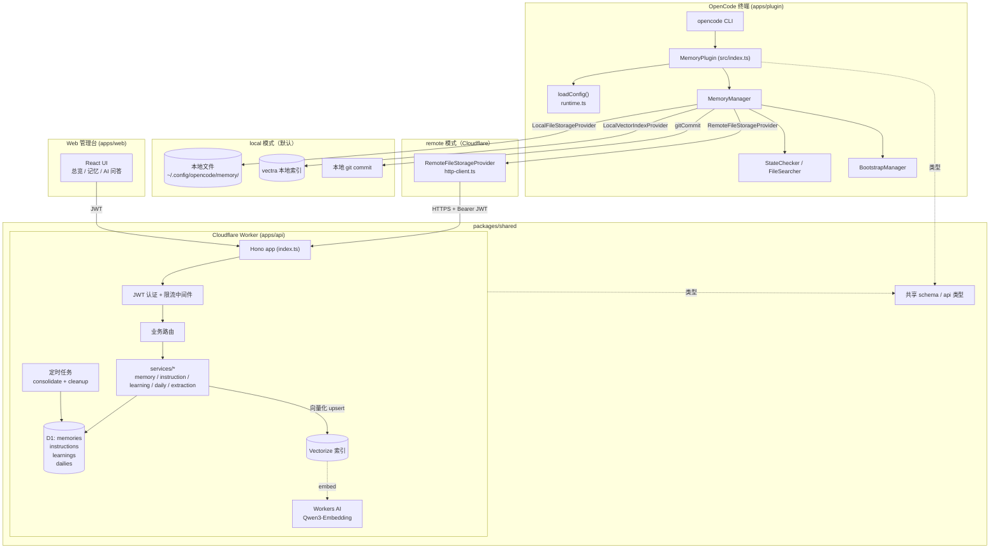
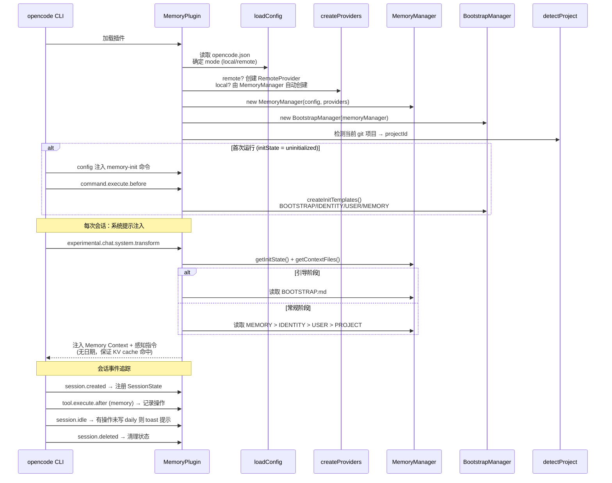
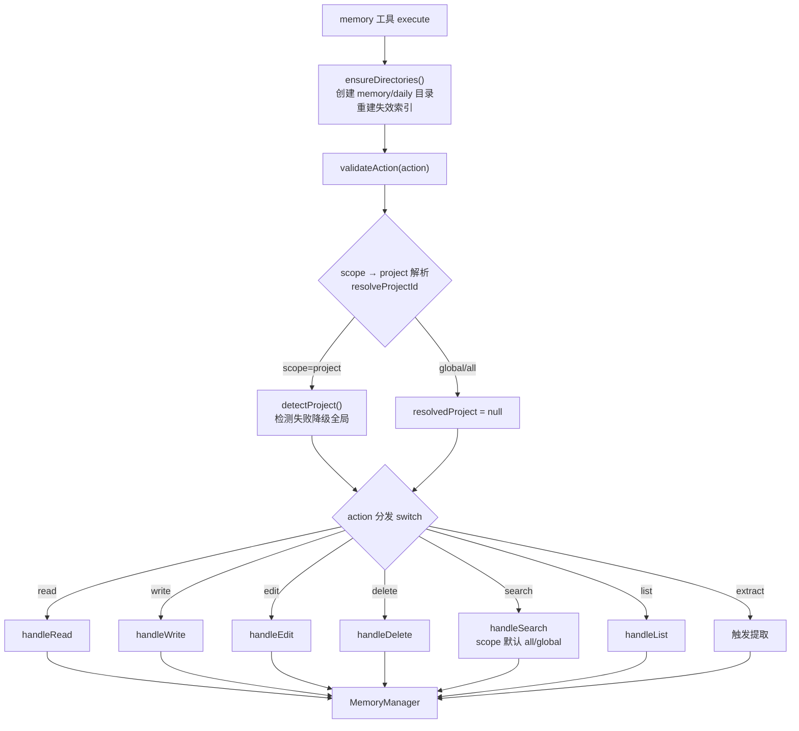
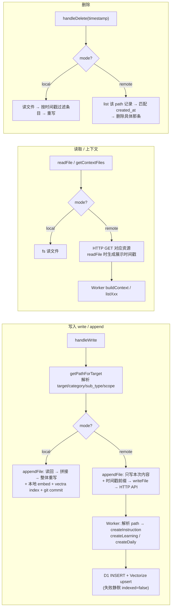
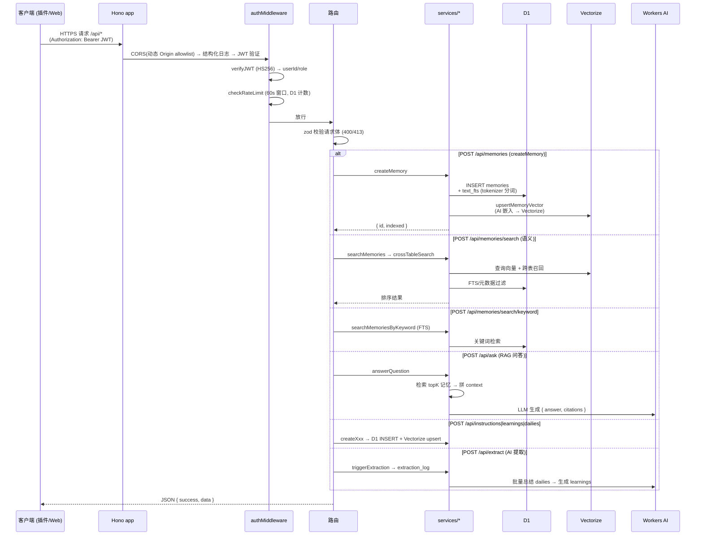
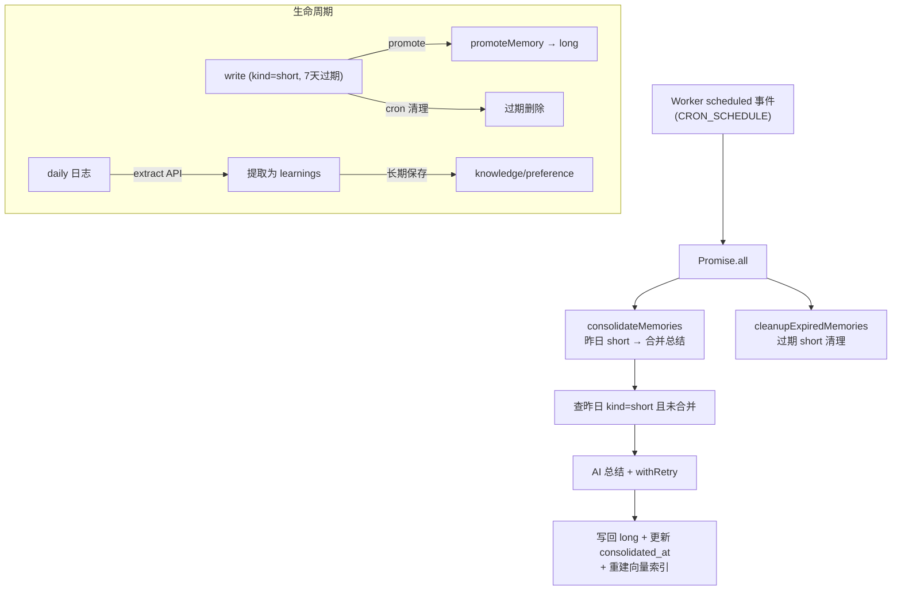

# opencode-memory 整体流程

> 版本: v1.0 | 日期: 2026-08-08
> 基于当前 main 分支代码 (`14b3e9a`)

---

## 1. 系统总览

---

## 2. 插件生命周期（启动 → 注入 → 工具调用）

---

## 3. memory 工具调用分发

---

## 4. 读写路径：local vs remote

---

## 5. Worker API 请求流程

---

## 6. 定时任务与数据生命周期

---

## 7. 目录结构与职责

| 目录 | 职责 |
|------|------|
| `apps/plugin/src/index.ts` | 插件入口：工具注册、事件监听、系统提示注入 |
| `apps/plugin/src/handlers/` | 7 个 action 的入参解析与结果格式化 |
| `apps/plugin/src/memory/MemoryManager.ts` | 核心：读写/追加/编辑/删除、路径解析、持久化+索引 |
| `apps/plugin/src/providers/{local,remote}/` | 双模式 Provider：文件/向量/嵌入 |
| `apps/plugin/src/search/` | 本地 chunker / embedding / vector-store |
| `apps/api/src/index.ts` | Worker 入口：中间件 + 全部 REST 路由 |
| `apps/api/src/services/` | 业务服务：memory/instruction/learning/daily/extraction |
| `apps/api/src/search/` | 跨表检索 / 混合搜索 / 分词 / 打分 |
| `apps/api/src/cron/` | 定时合并 + 过期清理 |
| `apps/web/src/` | React 管理台（总览/记忆列表/AI 问答） |
| `packages/shared/src/` | 共享 schema 与类型 |

## 8. 关键路径速查

- 插件 → Worker：`remote provider (http-client) → POST /api/memories | /api/instructions | /api/learnings | /api/dailies`
- 插件 → 本地：`MemoryManager → LocalFileStorageProvider (fs) → embed → vectra index → git commit`
- 上下文注入：`system.transform → buildContext → MEMORY/IDENTITY/USER/PROJECT（引导阶段为 BOOTSTRAP）`
- 认证链：`CORS → 日志 → JWT (HS256) → 限流 (D1 rate_limits) → 路由 → zod → service → D1 + Vectorize`
