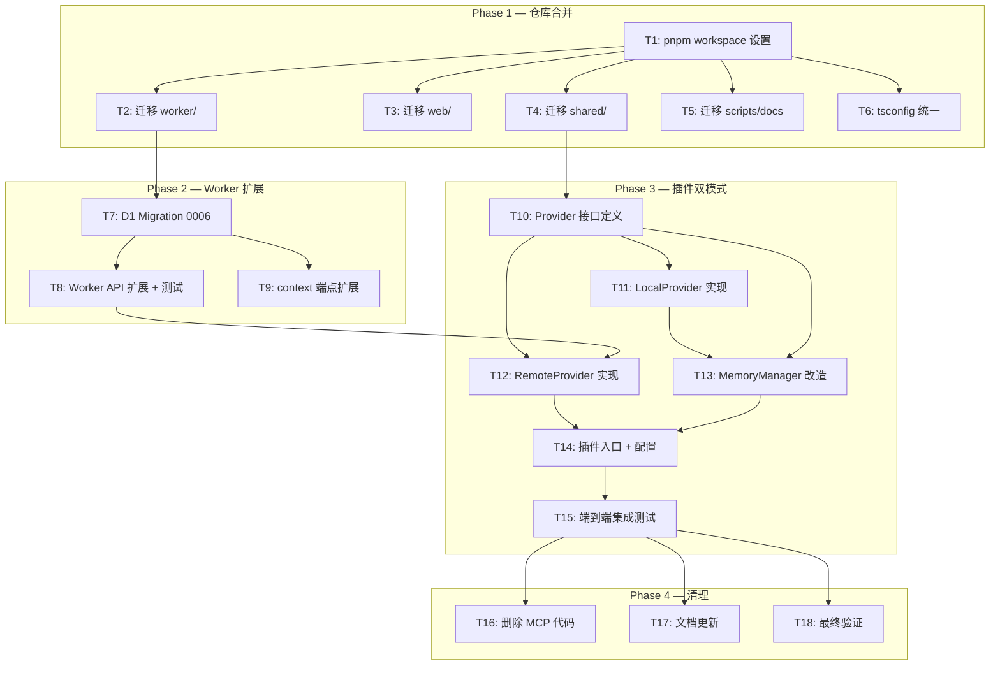

# 双模式架构合并 — DAG 任务图

> 基于技术方案 `docs/dev/specs/dual-mode-merge.md` §10 拆解
> 关联 PRD: `docs/prd/dual-mode-merge.md`
> 关联 ADR: `docs/adr/2026-07-22-dual-mode-merge.md`

---

## 整体依赖关系



---

## 执行顺序

| 阶段 | 顺序 | 说明 |
|------|------|------|
| Phase 1 | T1 → {T2, T3, T4, T5, T6} | T1 创建 workspace 后，5 个子任务可并行迁移 |
| Phase 2 | T7 → {T8, T9} | T7 创建 migration 后，T8/T9 可并行（T8 改 API，T9 改 context） |
| Phase 3 | T10 → {T11, T12} → T13 → T14 → T15 | 严格串行：接口 → 实现 → 改造核心 → 入口 → 测试 |
| Phase 4 | {T16, T17, T18} | 三个清理任务可并行执行 |

---

## 任务并行度

```
Phase 1:  T1 ████
          T2   ████
          T3   ████
          T4   ████
          T5   ████
          T6   ████

Phase 2:  T7     ████
          T8       ████
          T9       ████

Phase 3:  T10          ██
          T11            ██
          T12            ██
          T13              ██
          T14                ██
          T15                  ████

Phase 4:  T16                      ██
          T17                      ██
          T18                      ██
```

---

## 总估算

| 维度 | 数值 |
|------|------|
| 任务总数 | 18 |
| 可并行任务 | 10 (T2-T6, T8-T9, T11-T12, T16-T18) |
| 串行关键路径 | T1 → T2 → T7 → T8 → T12 → T14 → T15 → T18 |
| 预估总工时 | ~24-30 小时 |
| Phase 1 工时 | ~6-8 小时 |
| Phase 2 工时 | ~3-4 小时 |
| Phase 3 工时 | ~12-14 小时 |
| Phase 4 工时 | ~3-4 小时 |
