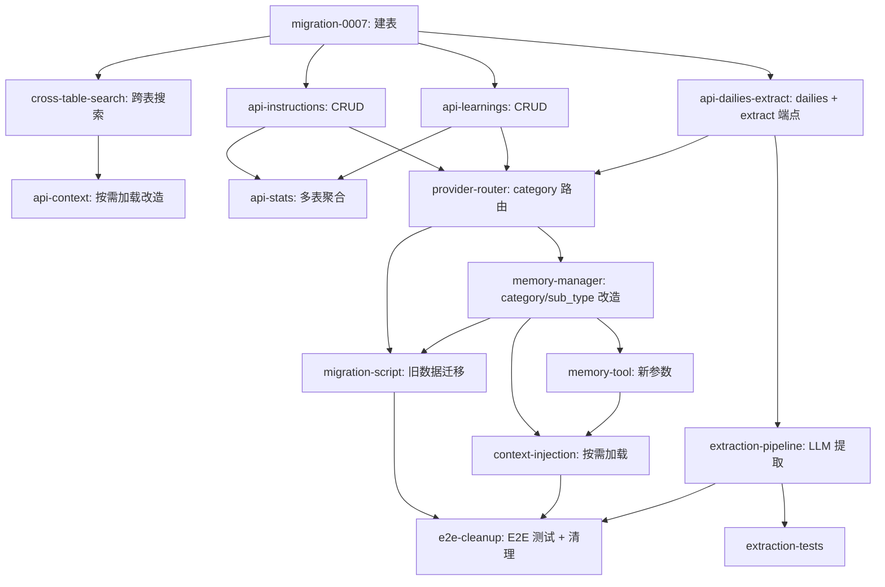

# 结构化记忆 — DAG 任务拆解

## 并行批次

| Batch | Tasks | 并行度 | 内容 |
|-------|-------|--------|------|
| 1 | T1 | 1 (串行) | D1 migration 建表 |
| 2 | T2, T3, T4, T5 | 4 | 跨表搜索 + 三组 CRUD 端点 |
| 3 | T6, T7, T8 | 3 | context/stats 改造 + provider 路由 |
| 4 | T9, T12 | 2 | MemoryManager + 提取 pipeline |
| 5 | T10, T13 | 2 | memory tool 参数 + 提取测试 |
| 6 | T11 | 1 | 上下文按需加载 |
| 7 | T14 | 1 | 数据迁移 |
| 8 | T15 | 1 | E2E + 清理 |

预估总工时：13-19h（8 个批次）
